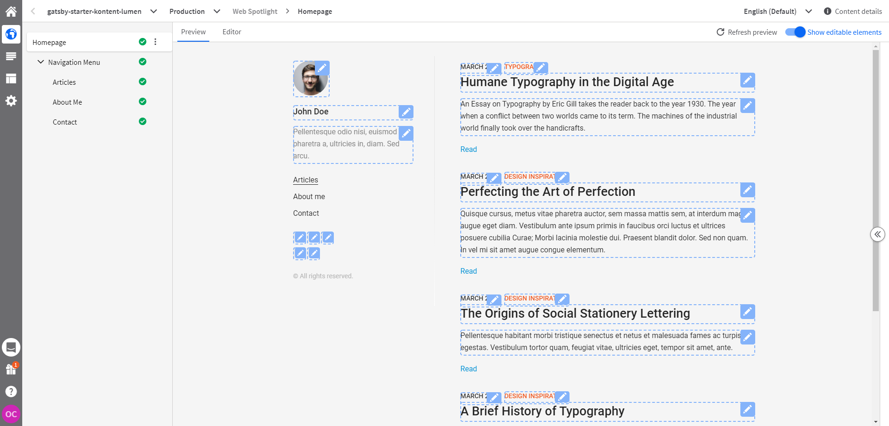
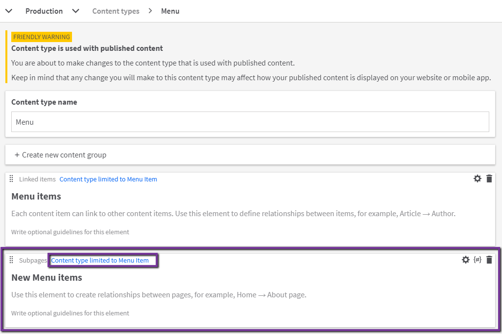
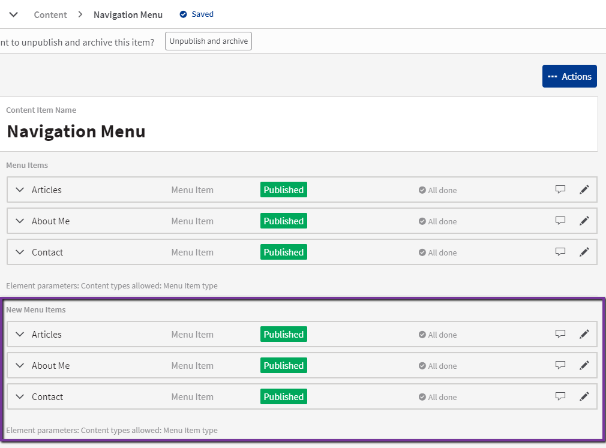
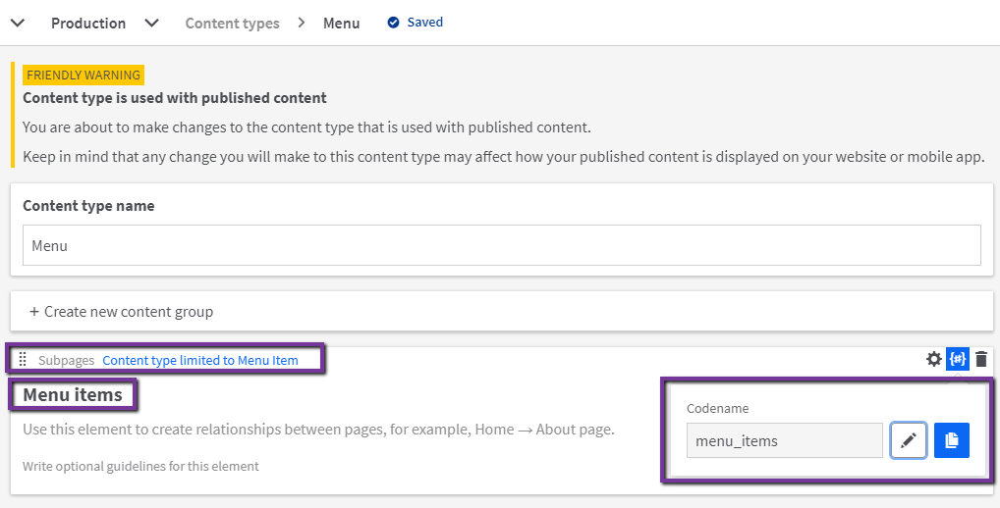
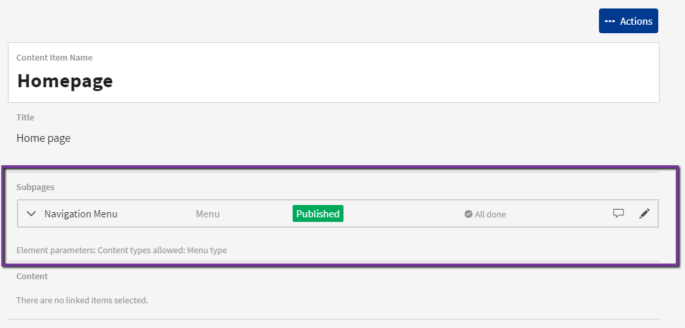

# Implementing Web Spotlight

[Web Spotlight](https://webspotlight.kontent.ai/) is an additional tool for [Kentico Kontent](https://kontent.ai) focused on website management. Feel the power of a headless CMS while enabling your content creators to produce and update content in the context of your website.

You could find more information about this feature in the [official documentation](https://docs.kontent.ai/tutorials/set-up-kontent/set-up-your-project/web-spotlight), or check out the [recording of "Sneak Peek: An introduction to Web Spotlight" webinar](https://kontent.ai/webinars/on-demand/introduction-web-spotlight).

_This guide will show you what needs to be done to be able to integrate your preview environment into the Web Spotlight._

## Prerequisites

* Have this starter already [connected to your own Kentico Kontent project](../README.md#Getting-Started).
* Have a [preview environment deployed](../README.md#Preview-Deploy)
  * Publicly available on static URL.
  * Preview webhooks configured to update the preview instance.

### Get started

It is required to do three steps. First, prepare the code for the Web Spotlight for preview environment, then turn on Web Spotlight on the Kontent project, and lastly use newly enabled features to connect the Kontent project to the preview environment.

### Kontent Smart Link SDK

The site has to use [Kontent Smart Link SDK](https://github.com/Kentico/kontent-smart-link#readme). In this example, the Smar Link SDK is already configured in the [layout component](../src/components/Layout/index.jsx) with the query string parameter name set to `preview-mode` and marking the element by the appropriate [data attributes](https://github.com/Kentico/kontent-smart-link/blob/master/README.md#data-attributes). You could use turn on the "Preview mode" by just adding a query string parameter to your URL (i.e. locally on <http://localhost:8000/?preview-mode=true>).

### Turn on Web spotlight

To purchase the Web Spotlight, you could [request a guided tour](https://webspotlight.kontent.ai/#form), or you could [Use the Intercom](https://docs.kontent.ai/tutorials/set-up-kontent/set-up-your-project/web-spotlight#a-boost-your-web-with-web-spotlight). Once the Web Spotlight is activated you will see in the Kontent UI new [WebSpotlight tab](https://docs.kontent.ai/tutorials/set-up-kontent/set-up-your-project/web-spotlight#a-what-web-spotlight-looks-like) and the [`Subpages` element type will be enabled](https://docs.kontent.ai/tutorials/set-up-kontent/set-up-your-project/web-spotlight#a-how-web-spotlight-works).

These objects are about to be created or enabled when the Web Spotlight is activated:

* Content type `Homepage` is created with `Subpages` elements.
  * One empty content item called `Homepage` based on that content type that works as a website root in Web Spotlight.
* Sample content type `Page` that should be used for menu definition. The example already contains a content model `Menu item` for this purposes ready and filled with data, so `Page` content type is not necessary to be used.

### Integrate preview with Web Spotlight

1. Instead of newly generated `Page` content type sample is using `Menu Item` page type for the menu definition purpose.

    * Remove `Page`content type (the one with no content items).
1. Convert `Menu items` element of `Menu` content type from `Linked items` element to `Subpages`. Following process ensure your content model remains compatible with code.
    * Open content types section.
        * Add new `Subpages` element to `Menu` content type and name it `New Menu items`.
        * Allow only add `Menu Item` content type.
        * Save the changes.
        * 
    * Open Content listing
        * Select `Navigation Menu` content item of type `Menu`.
        * Create a new version of this item.

        * Link the same content items that are linked from the `Menu items` element to `New Menu items`.

        * Publish the changes.
        * 
    * Open the Content Types section.

        * Remove `Linked items` element called `Menu items` from `Menu` content type (don't save changes).
        * Rename `New Menu items` element to `Menu items` (don't save changes).
        * Set `Menu items` element codename to `menu_items` (don't save changes).
        * Save the changes.
        * 
1. Link the `Navigation Menu` content item from the `HomePage` content item via the `Subpages` element and publish the change.

    * 
1. Last remaining step is to set up the [Preview URLs](https://docs.kontent.ai/tutorials/develop-apps/build-strong-foundation/set-up-preview#a-set-up-content-preview-in-your-project)
    * You should follow the [Preview URLs section](../README.md#Preview-URLs) to set them up.

----

**🚀 Now you have your Webs Spotlight ready and set! 🚀**

> If you have chosen Gatsby Cloud for your preview hosting, you are not even required to use `Refresh preview` button - the site should refresh itself once the site is rebuilt.

